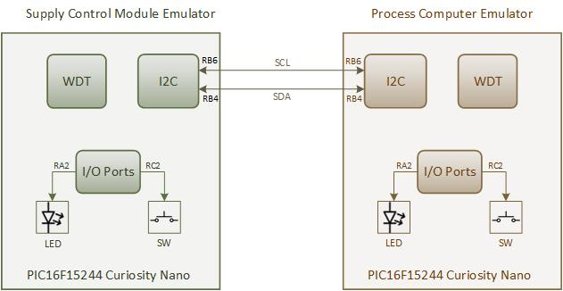
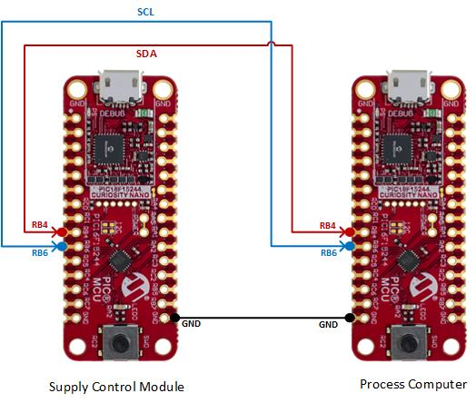

<!-- Please do not change this html logo with link -->

# System Power Supply Control Module Emulation using PIC16F15244 Microcontroller

## Introduction

Modern process computers, commonly based on high-end 32- or 64-bit microprocessors, provide developers with significant options in terms of operating system use. However, their high processing power is paid for with equally high-power demand, which can be a problem in battery-operated real-time applications. Using a simple low power and cost-effective 8-bit PIC microcontroller as the secondary device provides a convenient and cost-effective means of controlling the system power state. This discussion will consider the use of PIC16F microcontrollers in that role.

This GitHub code example demonstrates the use of the PIC16F15244 microcontroller in such applications for system power supply control. As a case study, for the demonstration, a reference application based on a Raspberry Pi© Single Board Computer (SBC) is used as the process computer (host) and a PIC16F15244 Curiosity Nano Evaluation Kit as a power supply control module (client). Additionally, the SBC functionality is also emulated with another PIC16F15244 microcontroller, as one of the use cases discussed in the code example.

For complete details of the application implementation, refer application note : [Using PIC16F15244 Microcontrollers for System Power Supply Control]( https://www.microchip.com/DS00004121).

## Related Documentation

- [Application note : Using PIC16F15244 Microcontrollers for System Power Supply Control]( https://www.microchip.com/DS00004121)
- [GitHub Microchip PIC Examples : System Power Supply Control Module using PIC16F15245 Microcontroller](https://github.com/microchip-pic-avr-examples/pic16f15245-system-power-supply-control-module-mplab-mcc)
- [GitHub Microchip PIC Examples : Process Computer Emulation using PIC16F15244 Microcontroller](https://github.com/microchip-pic-avr-examples/pic16f15244-cnano-system-power-supply-control-sbc-mplab-mcc)
- [PIC16F152xx Product Family Page](https://www.microchip.com/en-us/products/microcontrollers-and-microprocessors/8-bit-mcus/pic-mcus/pic16f15244)
- [PIC16F152xx Family Code Examples on GitHub](https://github.com/orgs/microchip-pic-avr-examples/repositories?q=pic16f152&type=all&language=&sort=)
- [PIC16F15244 MCU Family Video](https://www.youtube.com/watch?v=nHLv3Th-o-s)
- [PIC16F15244 MCU Product Page](https://www.microchip.com/en-us/product/PIC16F15244)

## Demo Description

For the demonstration of the supply control module application, two PIC16F15244 Curiosity Nano Evaluation Kits are used: One acts as host and the other as the client. The host is referred as process computer emulates the Raspberry Pi based SBC functionality. The client is referred as power supply control module, turns the regulator ON or OFF, this is emulated by the on-board LED. 

The process computer sends out a sleep command to the power supply control module over an I2C bus to shut down the system power. This sleep command contains the duration for which the process computer is to be put in Low-power mode. For simplicity, the on-board switch on the process computer (i.e., the PIC16F15244 Curiosity Nano Evaluation kit emulating the process computer) is used to trigger the sleep command.

After receiving the sleep command, the supply control module waits for 30 seconds before turning OFF the regulator. This period provides sufficient time for the process computer to perform the shutdown housekeeping tasks that are required for Linux® OS-like operating systems (such as invoking the shutdown procedure). The supply control module device disables the emulated voltage regulator, then enters Sleep mode. The supply control module will automatically turn ON the voltage regulator after the power-down period expires or an external trigger is provided. 

  

## Software Used

- MPLAB® X IDE [6.15.0 or newer](http://www.microchip.com/mplab/mplab-x-ide)
- MPLAB® XC8 [2.46.0 or newer](http://www.microchip.com/mplab/compilers)
- MPLAB® Code Configurator (MCC) [5.6.1 or newer](https://www.microchip.com/mplab/mplab-code-configurator)
- Microchip PIC16F1xxxx_DFP Device Support [1.24.387 or newer](https://packs.download.microchip.com)
- MCC Melody Core 2.6.4
- I2C_Client MCC Melody driver 2.0.3
- UART MCC Melody driver 1.10.0
- Timer0 (TMR0) MCC Melody driver 4.0.12

## Hardware Used

- PIC16F15244 Curiosity Nano Evaluation Kit [EV09Z19A](https://www.microchip.com/en-us/development-tool/EV09Z19A)

## Supply Control Module Implementation:

The Supply Control Module application firmware starts with the initialization of the system and required peripherals of the PIC16F15244 microcontroller. After initialization, it enters Power-Down mode. The microcontroller remains in Power-Down mode until it receives an I2C command from the process computer. To an I2C interrupt, the microcontroller wakes up from Sleep and verify whether the received I2C command is valid.
On reception of a valid Sleep command, the control module waits for a period of 30 seconds using a timer peripheral before turning OFF the regulator. Once the 30 second wait period is over, the application firmware disables the I2C peripheral and turns OFF the LED (voltage regulator), then enters Low Power mode by entering sleep. This wait period can be configurable by the user per application requirement. The supply control device wakes up periodically from Sleep mode using the Watchdog Timer (WDT). After the total power-down duration is complete or if a valid switch press event is detected, the supply control module turns ON the LED.

## Process Computer Module Implementation:

Refer code example [Process Computer Emulation using PIC16F15244 Microcontroller](https://github.com/microchip-pic-avr-examples/pic16f15244-cnano-system-power-supply-control-sbc-mplab-mcc) for more details about the process computer module implementation. 

## Demonstration Setup:

  

## Demo Operation:

For the demonstration, two PIC16F15244 Curiosity Nano Evaluation kits are used: one board as supply control module and other board as process computer. Setup the hardware as shown in demo setup section. Flash the supply control module firmware and process computer module firmware to the respective curiosity nano evaluation kits. The following points explains about functionality of the application.
1.	After flashing the firmware, supply control module enters power down mode and continues to remain in power down mode until it receives the I2C command from process computer module.
2.	Press onboard switch of the process computer (PIC16F15244 curiosity nano evaluation kit), which transmits the I2C command to the supply control module. LED blink is used as an indication for switch press event detection and for I2C command transmission . 
3.	Supply control module wakes up from the sleep as soon as it receives I2C command from the process computer which is indicated by LED blink.
4.	After reception of valid sleep command, supply control module waits for 30 secs before entering sleep mode. 
5.	Once the waiting period is over, then supply control module enters sleep mode by turning OFF the LED. It remains in the sleep mode for the sleep duration specified by the process computer.
6.	After the sleep duration is complete or press onboard switch, supply control module wakes up from the sleep and LED blink is used as an indication.

## System Power Supply Control for the Raspberry Pi Application:

This section demonstrates a use case of system power supply control for use with a Raspberry Pi-based reference application. The application functionality is similar to the implementation based on the PIC16F15244 Curiosity Nano kit. The process computer implementation is switched to the Raspberry Pi board and supply control module implementation is moved to the dedicated hardware setup, a PIC16F15245 control board.

Refer code example [System Power Supply Control Module using PIC16F15245 Microcontroller](https://github.com/microchip-pic-avr-examples/pic16f15245-system-power-supply-control-module-mplab-mcc) for more details about the implementation. 

## Conclusion:

This code example presents developers with a brief overview of how an 8-bit microcontroller can be used to improve the power consumption of a process computer, such as an SBC.
The proof-of-concept application presented here can be extended in various ways. For example,
oscillator inaccuracies and start-up delays can be compensated for by monitoring the actual sleep time by the process computer itself. That way, the process computer can change the amount of time the system is expected to sleep. In addition, various real-time tasks can also be offloaded to the 8-bit PIC microcontroller.

 